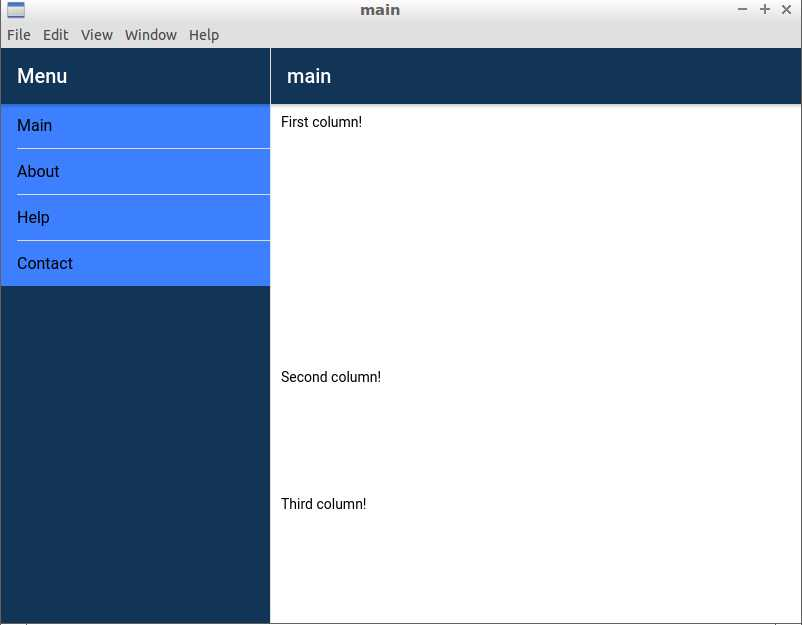

# Electron app built using Ionic 2



This repo is accompanying these tutorials on [techiediaries.com](https://www.techiediaries.com)

[Ionic 2 Split Pane for large screens and Desktop](https://www.techiediaries.com/ionic2-split-pane-desktop) which shows 
how to use Ionic 2 to build UI for Desktop apps created with Electron and how to use Ionic 2 Split pane component .

[Ionic 2 grid layout](https://www.techiediaries.com//ionic2-grid-layout) which shows
how to use the grid layout system in Ionic 2 .


A basic Electron application needs just these files:

- `package.json` - Points to the app's main file and lists its details and dependencies.
- `main.js` - Starts the app and creates a browser window to render HTML. This is the app's **main process**.
- `index.html` - A web page to render. This is the app's **renderer process**.

You can learn more about each of these components within the [Quick Start Guide](http://electron.atom.io/docs/tutorial/quick-start).

## To Use

To clone and run this repository you'll need [Git](https://git-scm.com) and [Node.js](https://nodejs.org/en/download/) (which comes with [npm](http://npmjs.com)) installed on your computer. From your command line:

```bash
# Clone this repository
git clone https://github.com/techiediaries/ionic2-electron

# Go into the repository
cd ionic2-electron
# Install dependencies
npm install
# Run the app
npm start
```

#### License MIT
